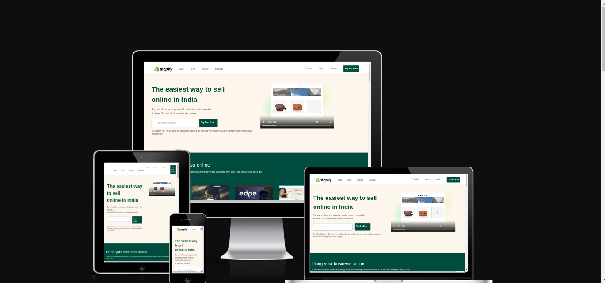
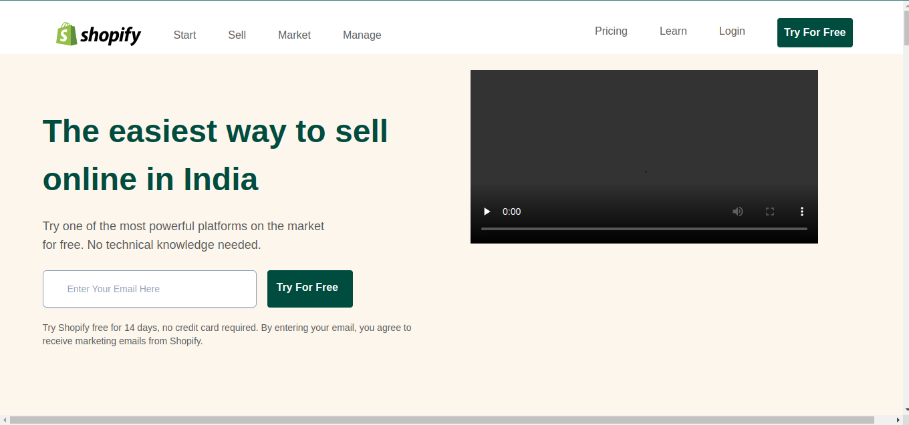
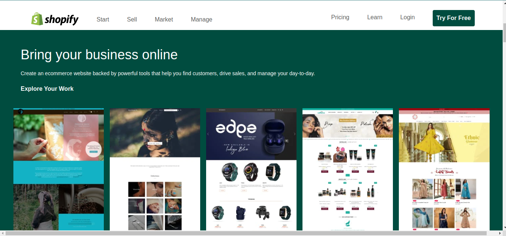
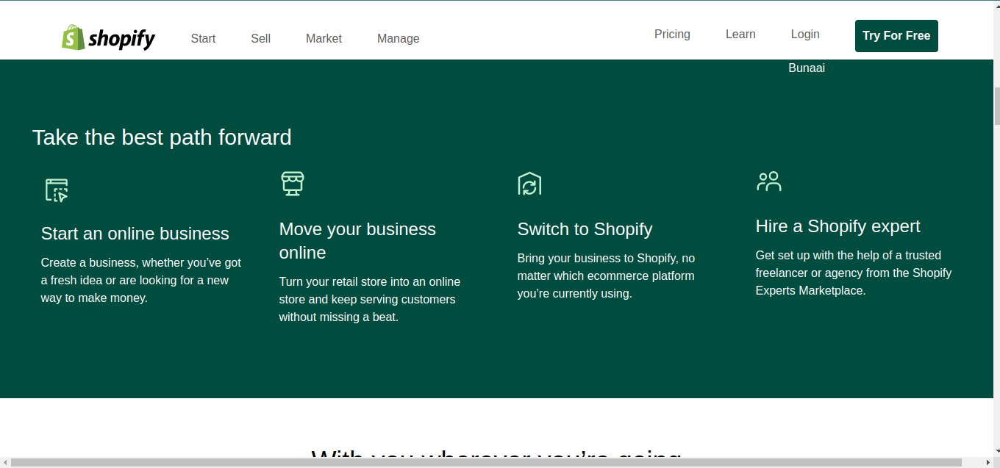
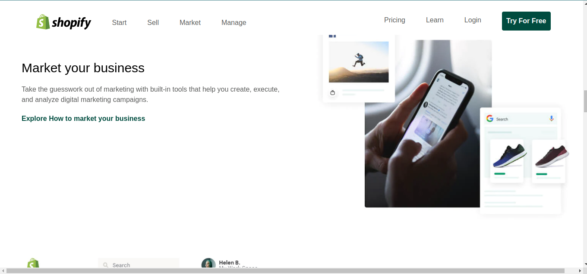
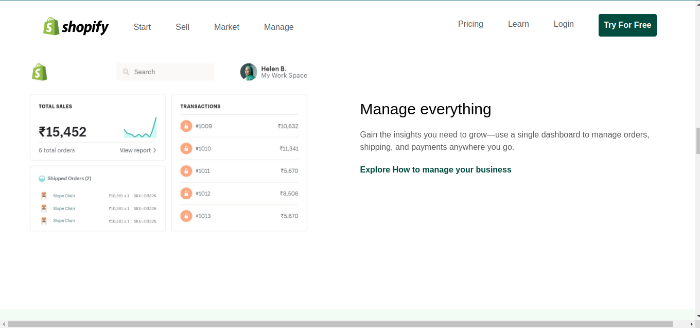
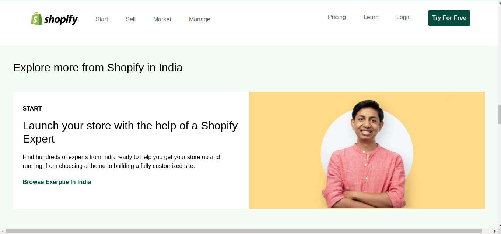
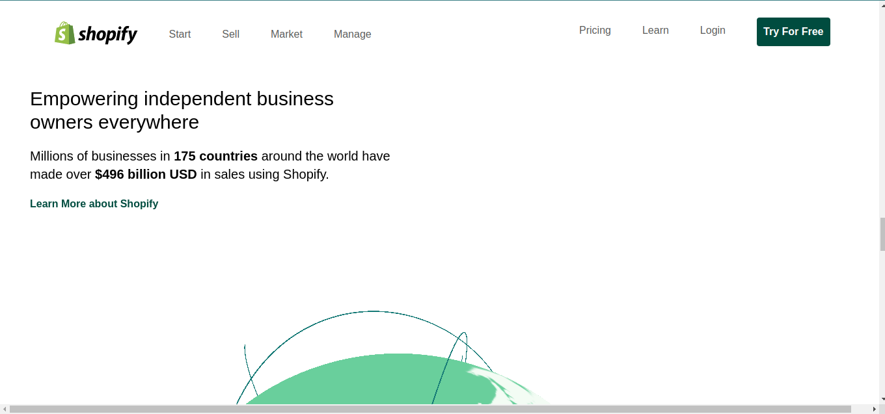
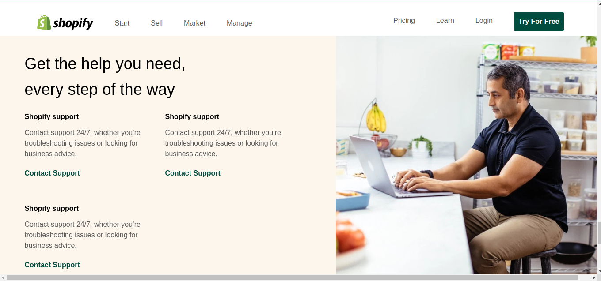
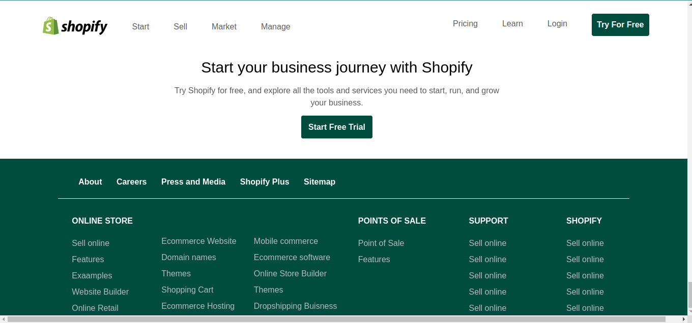

# I am Abhishek Singh
_I am learning Full stack javascript Development_

## This is the assignment that is the part of our live course.

### This is my second Tailwind project

### What I did in this project ?

_I made all the section with flex and grid and i learned how to add images in tailwind and now more confident in flex and grid in tailwind how this works on all screen sizes._
_And i learned how to  add position in navbar because i have to that navbar should fixed at top so learned about  position :stickey in tailwind._

# This is Responsive  but at some certain width like in ipad view some navbar issue only.

# Tailwind Project
1. Shopify Clone

# Technology used:
1. ```HTML5```
1. ```Tailwind CSS```

# Deployed Link
[Netlify Link](https://paytm-clone-apps.netlify.app/)












# Time Taken To Complete This project

_14hours_